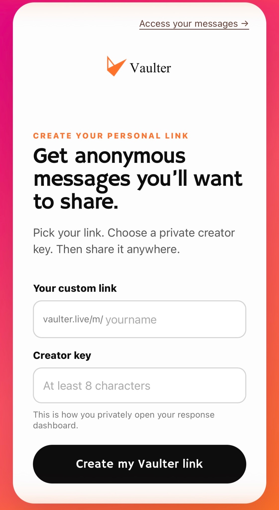
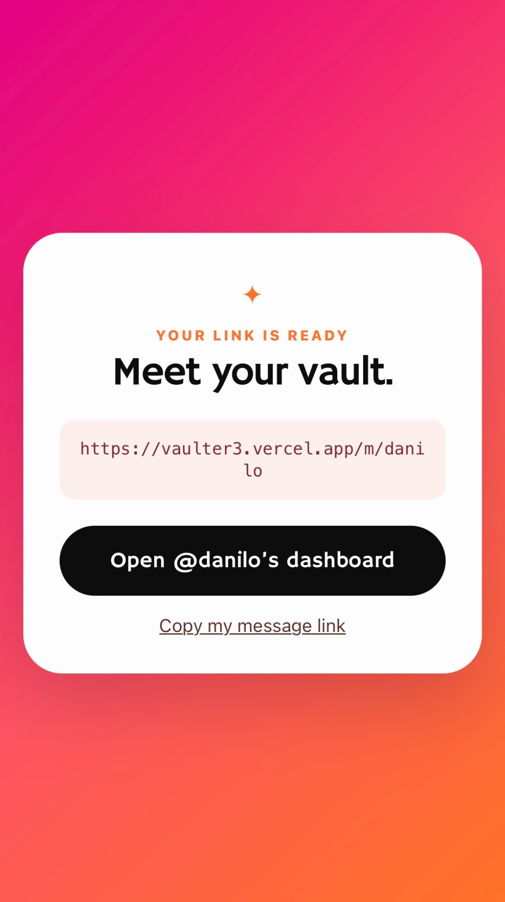
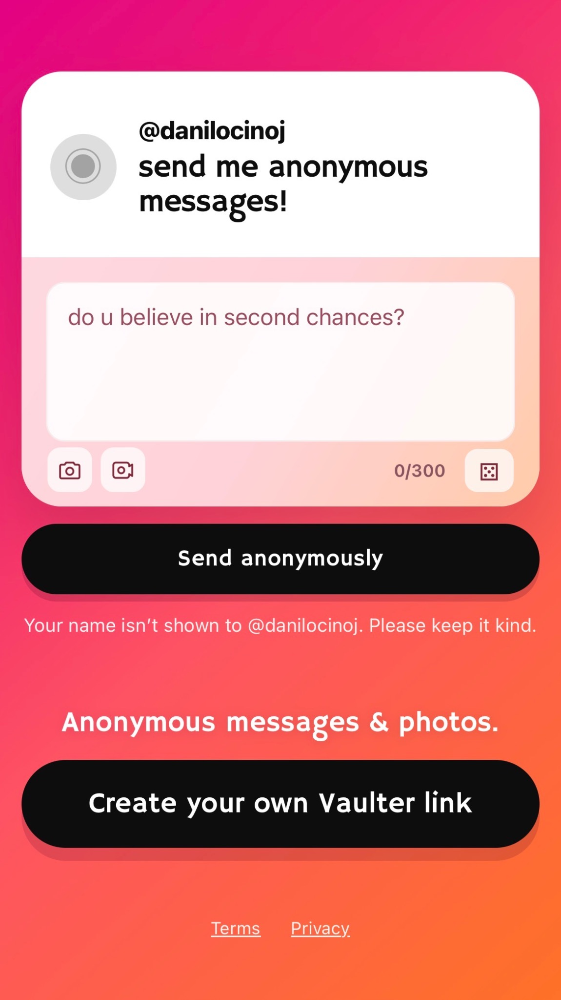
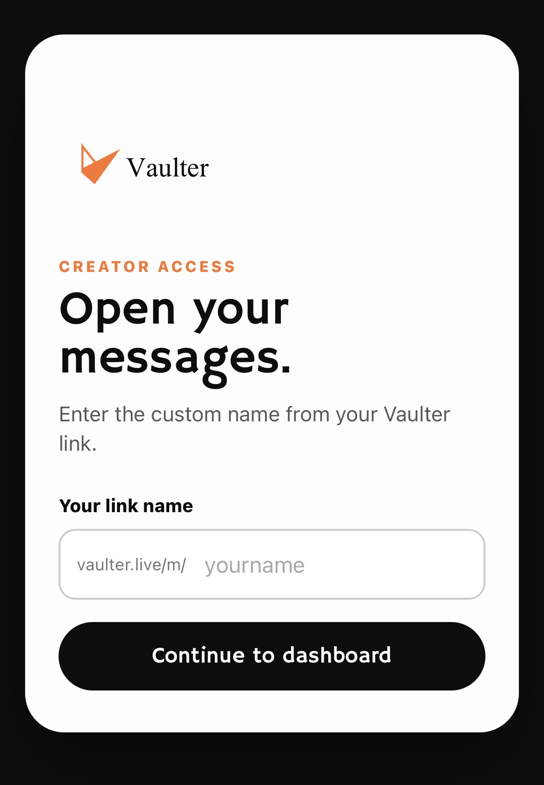
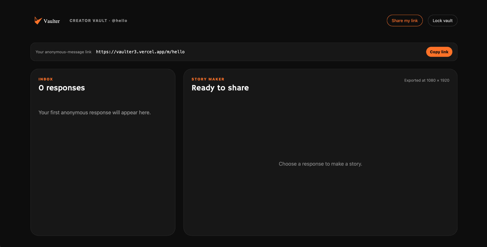
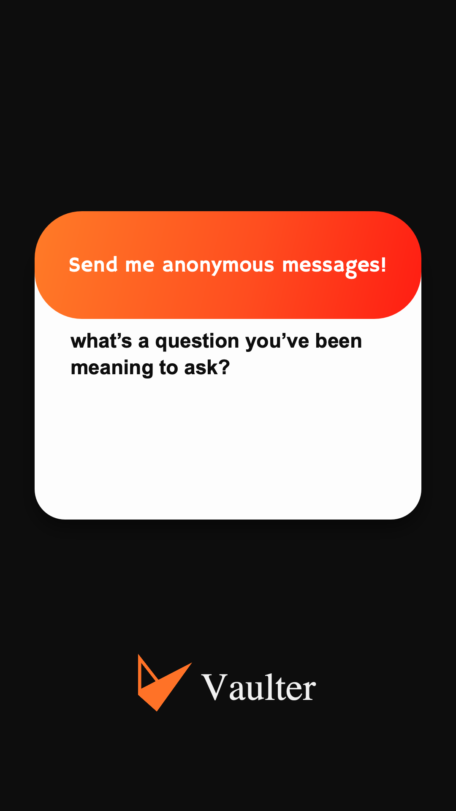
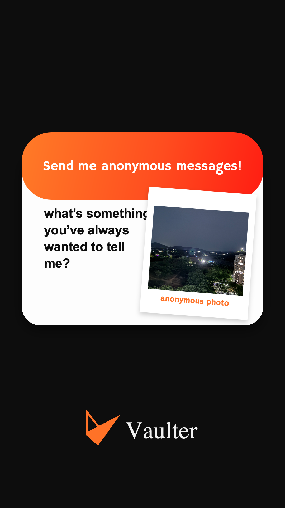
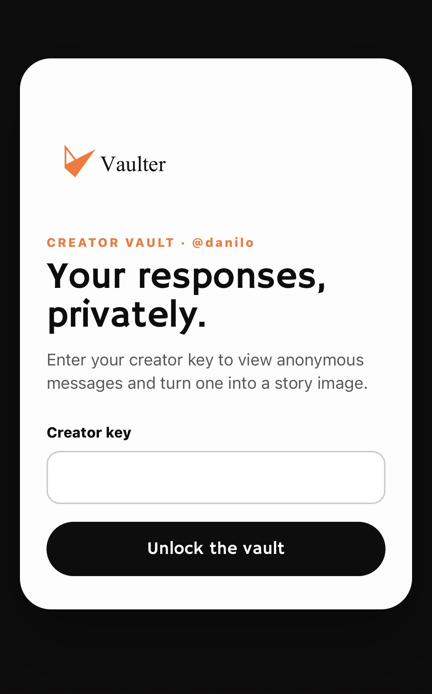

# Vaulter

Vaulter is a mobile-first anonymous messaging app for creators. A creator chooses a custom handle, shares a public link, receives anonymous text and image submissions, and can turn selected responses into vertical Story images.

This repository contains the Next.js application, its server-side API routes, and Supabase SQL migrations.

## Features

- Create a unique creator handle and public message link.
- Send anonymous text, an image, or both from a public message page.
- Choose an image from the device or capture one with a mobile camera.
- Private creator dashboard protected by a creator key and signed session cookie.
- Private Supabase Storage bucket for submitted images.
- Creator inbox with the 100 newest responses for that creator.
- Copy or use the native share sheet for a creator's public link.
- Export a response as a 1080 × 1920 PNG Story image, with native sharing when supported.
- Honeypot fields, server-side validation, and lightweight in-memory rate limiting.

## Screenshots

### Anonymous message & image sharing

<p>
  
  
</p>

### Creator setup & dashboard

<p>
  
  
</p>

<p>
  
</p>

### Story exports

<p>
  
  
</p>

### Public message page

<p>
  
</p>

## How it works

```text
Creator creates a handle
        ↓
/m/<handle> public page is shared
        ↓
Anonymous visitor submits text and/or photo
        ↓
Server validates and writes to Supabase
        ↓
/dashboard/<handle> displays that creator's messages
        ↓
Creator exports a response as a Story PNG
```

## Routes

| Route | Purpose |
| --- | --- |
| `/` | Create a custom handle and creator key, or access an existing dashboard. |
| `/m/[handle]` | Public anonymous message and image submission page. |
| `/dashboard` | Redirects an active creator session or asks for a handle. |
| `/dashboard/[handle]` | Creator dashboard, inbox, sharing controls, and Story maker. |

## Architecture

- Public React components submit form data to Next.js Route Handlers.
- Route Handlers use the Supabase service-role key on the server only.
- Submitted images are written to the private `message-images` Storage bucket.
- Image paths, message bodies, and creator handles are stored in Postgres.
- The dashboard API requires a signed, HTTP-only creator session whose handle must match the requested dashboard.
- Dashboard image URLs are short-lived Supabase signed URLs created by the server.

## Tech stack

- [Next.js](https://nextjs.org/) 14 (App Router)
- React 18
- TypeScript
- [Supabase](https://supabase.com/) Postgres and Storage
- Zod validation
- Native browser Canvas and Web Share APIs for Story exports

## Anonymous messaging and images

Public message pages accept a message, an image, or both. Message text is trimmed and limited to 300 characters. Images are limited to 8 MB and must be JPEG, PNG, or WebP; the server verifies file signatures before upload.

Images are never uploaded directly from the browser to Supabase. They are uploaded through the server to a private bucket, and the public client has no table or bucket read policies.

## Creator system and dashboard

Creator handles contain 3–30 lowercase letters, numbers, or underscores. Each creator sets a private creator key when creating a handle. The server derives a hash using the server-side dashboard secret; the plaintext creator key is not stored.

Opening `/dashboard/[handle]` requires that creator key unless a valid 12-hour signed session already exists. A dashboard can only request messages for the handle embedded in that signed session.

The dashboard can copy/share the public message link and generate a Story-sized PNG. Browsers that support the Web Share API can share the image through the native share sheet; other browsers download the PNG.

## Supabase setup

1. Create a Supabase project.
2. Open the SQL Editor, or use the Supabase CLI.
3. Apply every migration in `supabase/migrations/` in filename order:

   1. `20260814_create_vaulter_v1.sql`
   2. `20260814_add_message_images.sql`
   3. `20260814_create_creators.sql`

The migrations create:

- `messages` for anonymous text/image records.
- `creators` for custom handles and creator-key hashes.
- The private `message-images` Storage bucket.

They also enable Row Level Security and revoke `anon`/`authenticated` access to the app tables. Server API routes use the service-role key, which bypasses RLS and must remain private.

## Environment variables

Copy the template before starting:

```bash
cp .env.example .env.local
```

Set only server-side values. Do **not** use a `NEXT_PUBLIC_` prefix for any of them.

```env
SUPABASE_URL=https://[YOUR-PROJECT].supabase.co
SUPABASE_SERVICE_ROLE_KEY=[YOUR-SUPABASE-SERVICE-ROLE-KEY]
DASHBOARD_SESSION_SECRET=[A-LONG-RANDOM-SERVER-ONLY-SECRET]
```

`DASHBOARD_SESSION_SECRET` is used as a pepper for creator-key hashing and to sign dashboard sessions. Keep `.env.local` out of version control.

## Local development

Prerequisites: Node.js 18.17+ and a configured Supabase project.

```bash
npm install
npm run dev
```

Open [http://localhost:3000](http://localhost:3000). Before testing real submissions, apply the Supabase migrations and configure `.env.local`.

Useful commands:

```bash
npm run build
npm run start
```

## Deploying to Vercel

1. Push the repository to GitHub.
2. Import the repository in [Vercel](https://vercel.com/new).
3. Add the three environment variables listed above in **Project Settings → Environment Variables**.
4. Deploy. Vercel detects the Next.js app automatically.
5. Configure your production domain and share links in the form `https://[YOUR-DOMAIN]/m/[HANDLE]`.

Never expose the Supabase service-role key in browser code, client-side configuration, or public build variables.

## Security considerations

- Database and Storage reads are not available to browser roles.
- The Supabase service-role key is loaded only in server-only modules.
- Creator keys are derived with `scrypt` plus the server-side dashboard secret; plaintext keys are not stored.
- Dashboard sessions are HMAC-signed, HTTP-only, `SameSite=Lax`, and expire after 12 hours.
- Public submission and creator-creation routes use basic per-instance IP rate limiting plus hidden honeypot fields.
- Message text is displayed as text, not injected as HTML.
- Image MIME signatures are verified before storage.

For production traffic, add an edge or shared rate limiter (such as Vercel WAF or Upstash) and consider moderation/reporting workflows before broad public use.

## Project structure

```text
app/
  api/                 Server-only submission, creator, and dashboard endpoints
  dashboard/           Creator dashboard routes
  m/[handle]/          Public creator message page
components/            Client UI for forms, creator setup, inbox, and Story maker
lib/                   Validation, Supabase client, rate limiting, session helpers
public/                Vaulter logo assets
supabase/migrations/   Database and Storage setup SQL
```

## Limitations

- Creator access uses a creator key; there is no password reset or account recovery flow.
- Dashboard pagination is not implemented; it loads the newest 100 messages.
- Rate limiting is in memory and therefore applies per server instance.
- No inbox moderation, reporting, deletion UI, notification delivery, or email/SMS creator alerts exist.
- Direct Instagram posting is not available from the web. The app uses the native share sheet when supported, otherwise it downloads a Story PNG.
- Image uploads support JPEG, PNG, and WebP only.

## Roadmap

Potential future work:

- Account recovery and creator authentication improvements.
- Shared/edge-backed rate limiting and abuse controls.
- Message moderation, reporting, and creator deletion tools.
- Pagination, filtering, and inbox search.
- Notifications for new responses.
- More Story layouts and customizable branding.
- Automated tests and CI.

## Contributing

Contributions are welcome.

1. Fork the repository and create a focused branch.
2. Keep changes typed, accessible, and scoped to the issue.
3. Run `npm run build` before opening a pull request.
4. Describe user-facing behavior, database migration requirements, and any environment changes in the pull request.

Do not commit `.env.local`, service-role keys, session secrets, signed URLs, or real user data.

## License

Vaulter is open source software licensed under the [MIT License](LICENSE).